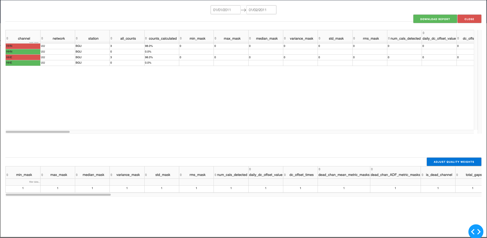
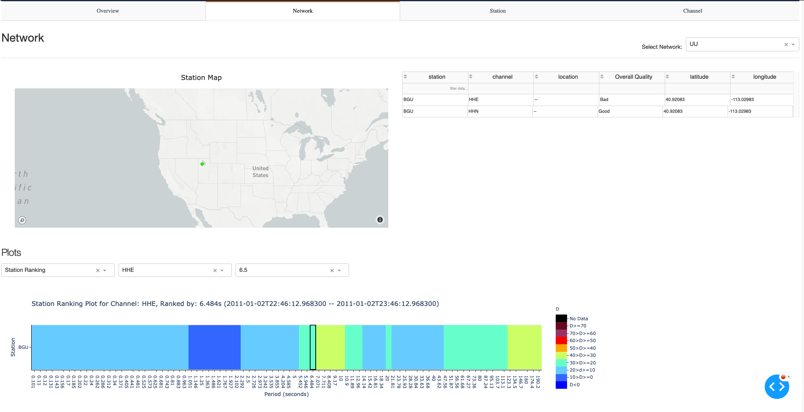
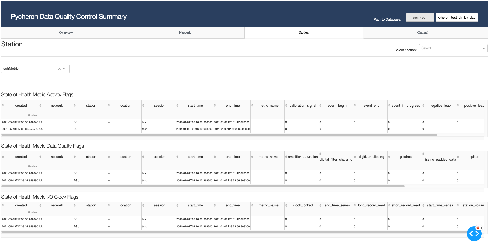
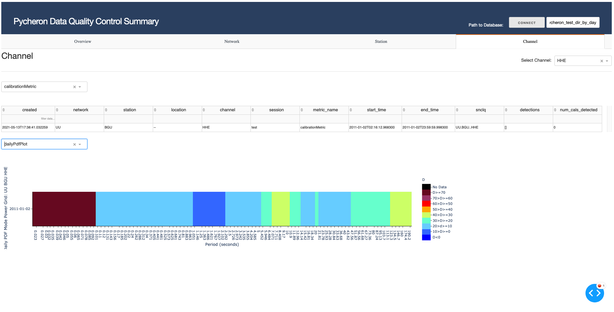

# Pycheron v3.0.0<br>

Developed by Kale Aur (kaaur@sandia.gov), Jessica Bobeck (jbobeck@sandia.gov), Anthony Alberti (aalber@sandia.gov), 
and Phillip Kay (prkay@sandia.gov)

For an overview of Pycheron, its features, basic workflow, and an example application using a synthetic QC dataset, please refer to the following paper: Aur, K.A., Bobeck, J., Alberti, A., Kay, P. (2021) Pycheron: A Python-based seismic quality control software package. Seismological Research Letters, Volume XX, Number XX.

Python library for seismic data quality control originally ported from IRIS's IRISMustangMetrics, IRISSeismic, and
seismicRoll R packages:

*   IRISMustangMetrics R Cran Package
    (Callahan, J., R. Casey, M. Templeton, and G. Sharer (2020, March 20). CRAN-Package IRISMustangMetrics.
    The Comprehensive R Archive Network. Retrieved from
    https://cran.r-project.org/web/packages/IRISMustangMetrics/index.html)

*   IRISSeismic R Cran Package
    (Callahan, J., R. Casey, G. Sharer, M. Templeton, and C. Trabant (2019, Oct 22). CRAN-Package IRISSeismic.
    The Comprehensive R Archive Network. Retrieved from https://cran.r-project.org/web/packages/IRISSeismic.index)
    
*   seismicRoll R Cran Package
    (Callahan, J., R. Casey, M. Templeton, and G. Sharer (2020, July 8). CRAN-Package seismicRoll. The Comprehensive R
    Archive Network. Retrieved from https://cran.r-project.org/web/packages/seismicRoll.index)

*   Many of the baseline function thresholds are based on IRIS's thresholds found in the section labeled 
    `Some Metric Tests for Broadband Data`: 
    IRIS: Tutorials: Seismic Data Quality Assurance Using IRIS MUSTANG Metrics. (2016, April 26). Tutorials: Seismic Data Quality Assurance Using IRIS MUSTANG 
    Metrics. https://ds.iris.edu/ds/nodes/dmc/tutorials/seismic-data-quality-assurance-using-iris-mustang-metrics/


## Operating Systems
Pycheron has been tested on Linux/OSX systems, but issues still exist on Windows machines. **Please ensure the OS is either Linux/OSX before using.**

## Setting up a virtual environment before install
The tool used for dependency management ([Poetry](https://python-poetry.org/)) requires the use of a virtual environment manager. 
Below are a few virtual environment management options; however, depending on the system architecture (i.e., Windows, Mac, or Linux), some may work better than others. Given the option, it is `strongly recommended` to use Anaconda:

* [venv](https://docs.python.org/3/library/venv.html) (comes default with Python 3.3+)
* [PyEnv](https://github.com/pyenv/pyenv) (does not work on Windows)
* [Anaconda](https://docs.anaconda.com/anaconda/install/)
* [PipEnv](https://github.com/pypa/pipenv)

Alternatively, if a specific environment manager is not chosen beforehand, Poetry will create one. 

Note, a **Python 3.6.9** environment is required and must be *activated before installing packages and using Pycheron. 

## Installing
Before installing Pycheron, download:

1. [poetry](https://python-poetry.org)
2. [git-lfs](https://git-lfs.github.com/)

The links above will have install instructions available.

After git-lfs is installed, run the following commands in the Pycheron root directory:
```bash
git lfs install
git lfs fetch
git lfs pull
```


The easiest way to install Pycheron is to run:

`./build.sh 3.0.0`

where 3.0.0 is the version number of Pycheron. This bash script will uninstall any old versions of Pycheron and install all necessary Python dependencies.

If contronted with an `EOFerror` raised by Pebble, try installing Pebble version 4.3.10 and re-run the `build.sh` script.

## Build from scratch

To build the Pycheron version from scratch run the following command from the Pycheron top-level directory:

`poetry build`

and then:

`cd dist`

Then use pip to install the .whl file:

`pip install pycheron-<version>-py3-none-any.whl`

## Installing Oracle dependencies
`cx_Oracle` requires that Oracle Instant Client be installed. Instructions for installation can be found [here](https://cx-oracle.readthedocs.io/en/latest/user_guide/installation.html#install-oracle-client). Be sure to export the `LD_LIBRARY_PATH` environment variable before using.

## Known Issues
If using Mac OSX with an Anaconda environment and receive errors relating to matplotlib, matplotlib will need to be reinstalled using version 2.2.5 with the command `conda install matplotlib=2.2.5". Afterwards, re-build Pycheron using the build script. 

## Fortran
It is recommended to use gfortran 6.3 for OSX. Currently Fortran compilations only work on OSX and Linux. If using a Windows operating system, there is an option to turn off Fortran in the functions that use it (e.g., `staltaMetric`, `psdMetric`,`spikesMetric`, `repeatedAmplitudeMetric`)
by setting the variable `fortran` equal to `False`. Please refer to the 'Operating Systems' section regarding Windows use with Pycheron.

## How to run Pycheron's backend
Data is ingested into Pycheron by directing the package to a local directory 
containing data files, a single data file, a CSS3.0 wfdisc table (flatfile), an ObsPy stream, or a database containing 
CSS3.0 formatted tables. Pycheron’s main interface is via a wrapper code, `callPycheronMetric.py`, that reads from a 
configuration YAML Ain’t Markup Language (YAML) file, `pycheronConfigTemplate.yaml`. The `pycheronConfigTemplate.yaml` file can be found in the top-level directory of Pycheron.
<br> 
The configuration template file specifies: 

   1) from where Pycheron reads input data; 
   2) what QC metrics are calculated; 
   3) QC metric parameter and threshold settings; 
   4) plotting information; and 
   5) various other parameterizations

`callPycheronMetric` combines all of the metrics in the `pycheron.metrics` package and executes them. For each QC issue, 
weighting is assigned based on user input and an overall QC summary is created on a per station basis. Currently, all QC
metrics are assigned a default weight of 1 (i.e., 100%), meaning they are weighted equally. Users can adjust each QC 
metrics weights within the UI and the quality summary report and color coding will be adjusted on the fly. Work is in 

All results are stored in a Sqlite3 database and can either be visualized in a user interface (UI) via Plotly’s 
Dashboard Web UI, Dash, or output to comma-separated value (CSV) files that are more readily processed through an 
automated pipeline. 

`pycheronConfigTemplate.yaml` is a configuration template containing all configurable input parameters 
and their default values. The `pycheronConfigTemplate.yaml` file can be found in the top-level directory of Pycheron.

When updating values which require file paths, ensure the **full path** is used and not the relative path.

Please refer to the sections below for instructions on how to run Pycheron with the following data types:

* Directory (of MSEED files)
* Wfdiscs (CSS)
* Obspy Streams
* Singular MSEED file 
* Wfdisc database (Oracle)

## Datasets

Pycheron can ingest several different data formats. `callPycheronMetric` currently accepts five data types:

- Directory (of MSEED files) (datatype = `dir`)
- Wfdisc (CSS) (datatype = `wfdisc`)
- Obspy Stream (datatype = `stream`)
- Singular MSEED file (datatype = `mseed`)
- Wfdisc database (Oracle) (datatype = `wfdb`)

All data formats are converted into ObsPy Stream or Trace objects for use inside Pycheron. 
Thus, any format read by ObsPy can also be used within Pycheron. The data type needs to be defined in the YAML
configuration file, as does the data file's directory path. 
Depending on the data ingested there are different parameters that can be set; these will be discussed in the 
`callPycheronMetric Example` section. 

### Directory (datatype = `dir`)

If a directory is utilized, Pycheron assumes that all files are `MSEED` formatted files. The following 
folder structure is required:

```
My Folder
    BGU_EHE_001.mseed
    BGU_EHN_001.mseed
    BGU_EHE_002.mseed
    BGU_EHN_002.mseed
    JPU_EHE_001.mseed
    JPU_EHN_001.mseed
    JPU_EHE_002.mseed
    JPU_EHN_002.mseed
    TCRU_EHE_001.mseed
    TCRU_EHN_001.mseed
    TCRU_EHE_002.mseed
    TCRU_EHN_002.mseed
```

Each file should be formatted as follows: `<station>_<channel>_<julian day>.mseed`. 
The data utilized within this tutorial is already formatted correctly. The `<station>_<channel>_<julian day>.mseed` format is required when using the `dir` option from callPycheron.

### Wfdisc (CSS) (datatype = `wfdisc`)
If a Wfdisc (CSS) flat file is utilized, the `.wfdisc` file is the only input file needed.  
However, it is important to ensure that the `.w` file paths in the dir column listed in the `.wfdisc` file are 
relative to the file. This directory structure is required when reading wfdisc data.

For example, using the following directory structure below:

```
My Folder
    data.wfdisc
    data_directory
        OWUT_EHZ_001.w 
        OWUT_EHZ_002.w 
        OWUT_EHZ_003.w 
        .
        .
        .
        waveformN.w
```

The dir column in the `data.wfdisc` file should appropriately point to the My Folder/data_directory for each `.w` file 
so that Pycheron is able to properly retrieve the respective file:

```
OWUT   EHZ       1293840000.00000   1927888      774  2011001  1293860963.29000  2096330  100.000000          1.00000         -1.00000 -      o i4 - /My Folder/data_directory/               OWUT_EHZ_001.w                            0        -1 10-APR-18        
OWUT   EHZ       1293861020.31000   1927890      774  2011001  1293861041.29000     2099  100.000000          1.00000         -1.00000 -      o i4 - /My Folder/data_directory/               OWUT_EHZ_002.w                      8385320        -1 10-APR-18        
OWUT   EHZ       1293861041.41000   1927892      774  2011001  1293865831.39000   478999  100.000000          1.00000         -1.00000 -      o i4 - /My Folder/data_directory/               OWUT_EHZ_003.w                      8393716        -1 10-APR-18        
```

When using this datatype, it is required to specify the network to process stations within (set via the `network` 
parameter)

Users also have the option to:
 
 *  Specify station to process using the `station` parameter; only processes that single station's data 
 *  Split data up by days into a stream object using the `byDay` parameter 
 *  Specify which station to start processing at using the `stationStartAt` parameter; starts processing data for that 
    station instead of processing data from the beginning of the wfdisc file and continues processing subsequent 
    stations 


### Mseed (datatype = `mseed`)

This datatype indicates that the user wishes to read in a single `mseed` formatted file.  
If the file contains multiple days worth of data, it is recommended to use the directory datatype and split
the data into smaller segments. 

### Stream (datatype = `stream`)

This datatype should only be used when inside a Python console and not while executing via the command line. 
When this type is specified, it is assumed that the Stream has either been manually loaded using 
`obspy.read()` or downloaded using the ObsPy client and then calling `callPycheronMetric()` as a function.

### Connecting to a database with Wfdisc tables (datatype = `wfdb`)

Pycheron currently supports connection to Oracle databases via SQLAlchemy. This datatype option supports 
reading Wfdisc database tables of the CSS 3.0 format.

Before accessing the Oracle Wfdisc database, users will need to check their connection settings from the `connect_dict` value in the [configuration file](./pycheronConfigTemplate.yaml) to ensure the correct db values exist and a connection can be made with the database. One option would be with [Oracle SQL Developer](https://www.oracle.com/database/technologies/appdev/sqldeveloper-landing.html).

The following tables are required in the Wfdisc database for the `wfdb` option to function correctly:

* WFDISC
* SITE
* SENSOR
* INSTRUMENT
* AFFILIATION
* SITECHAN

These may be named differently, but must exist, and are set via the `table_names` parameter. A more detailed description of which fields/types must exist in each of these tables can be found [here](ftp://ftp.pmel.noaa.gov/newport/lau/tphase/data/css_wfdisc.pdf).

When retrieving data from a database, there will be instances where results from the tables will include a directory to retrieve files from (i.e., an INSTRUMENT table may have a field that points to a file location of a RESP file). In these instances, it's important that the file is accessible by the user locally. If accessing files from an external drive/directory, ensure the drive/directory is mounted before attempting to access it. These paths must be **full filepaths** (not relative paths) to access the data.

Thu user has the option to specify the wfdisc `start_time` and `end_time` using the `wfdb_start` and `wfdb_end` parameters.

When modifying the configuration file, the user also has the option to configure the minimum amount of time between `start_time` and `end_time` of the WFDISC table in the database using the `wfdb_mintime`. The available options are:

* "day" (with quotes, lowercase)
* "hour" (with quotes, lowercase)
* None (without quotes, uppercase N)

There are some functions in Pycheron (when calculating PSDs, for example) that will not return valuse if a given `start_time` or `end_time` are less than a fixed amount of time (e.g., PSDs require at least one hour). This gives the user the option to filter out any results that wouldn't be able to generate metrics otherwise.


### `callPycheronMetric` Input Parameters

The `callPycheronMetric.py` script is installed as a script so that it can be executed directly from the command line. 
The `callPycheronMetric` has over 50 input parameters specified, with a majority of them related to setting default 
threshold values for each of the corresponding metrics. These thresholds determine whether a QC issue is flagged. 
Each QC metric has its own set of parameters that may be adjusted.
Thus, it is recommended to thoroughly read through the documentation page within the  `callPycheronMetric` script as 
each parameter is well-documented. 

### Running Pycheron via Command Line

The easiest way to run `callPycheronMetric` is via the command line with the `pycheronConfigTemplate.yaml` file. 
After installation and configuration are complete, Pycheron can be run via the terminal 
with the following command:

`python <path>/<to>/callPycheronMetric.py <path>/<to>/<CONFIG FILE>.yaml`

For this tutorial, the `pycheronConfigTemplate.yaml` is accessible via the `data` folder.

## Pycheron Output Options

### CSV output 

Output to a CSV file is possible. The output is saved into the following folder structure: 

```
<output_directory>
    <network_dir>
        <station_dir>
            <channel_1_dir>
                <metric>.csv
                <metric_plot>.png
            <channel_2_dir>
                <metric>.csv
                <metric_plot>.png
            <station_level_metrics>.csv
            <station_level_plot>.png
         <network_level_metric>.csv
         <network_level_plot>.png
```

### Database output 


If desired, Pycheron can output results into a local sqllite database (this method of output is required to use 
the Pycheron UI). The default name for the database is `pycheron.db` but this can be changed within the 
`pycheronConfigTemplate.yaml` file using the `database` parameter. The `session` parameter, which sets the session name
in the database, can also be utilized to group different processing runs/experiments (default = None). Lastly, 
the `overwrite` option exists to overwrite entries that have the same snclq and start/end time. 

The database tables that exist within the generated output database will depend on which QC metrics were specified 
to be calculated. If `calcAll = True` was specified, then all available tables will be generated. Pycheron can generate 
a table for the following information: 

*   A main pycheron table containing basic metadata information 
*   Each QC metric within the metrics directory (SOH metric is broken up into several tables)
*   Station and network noise models 
*   PsdStatistics function
*   Plotting function tables (e.g., psdPlot, dailyPDFPlot) 
*   Summary report counts and values table used for the QC Summary Report within the Pycheron UI (see UI section
    below for more information 

Users can choose to view the database tables via any sqqlite database viewer of their choosing, such as 
[sqlitebrowser](https://sqlitebrowser.org/) (more on this [below](#viewing-results)).


##  callPycheronMetric Examples

This section will walk users through how to use Pycheron with each input data type. 

Sample data files for this tutorial live within the `tutorials/data` directory within the Pycheron top-level directory. 

To process the data, execute the following steps: 

1. To de-compress the data, first cd into the aforementioned directory: 

   `cd /tutorials/data` 

    then run:

    ```
    tar -xzvf callPycheronMetric_tutorial_small.tar.gz 
    ```

    This should create a directory called `pycheron_test` that contains six `mseed` data files,
    a `.wfdisc` file, and a `.w` file nested in a `/data` directory. The `mseed` data spans from 2011/01/01-2011/01/02, 
    for one stations within the University of Utah (UU) seismic network: BGU (HH* channels). The wfdisc table/file 
    contains data for BGU HHZ 2011/01/01.
    
    >Alternatively, for a  larger data set, run the following command instead (`NOTE: the larger data set will take significantly longer to run`):
    >
    >```
    >tar -xzvf callPycheronMetric_tutorial_data.tar.gz 
    >```
    >
    >This should create a directory called `pycheron_test` that contains several `mseed` data files, a `.wfdisc` file, 
    >and a `.w` file nested in a `/data` directory. The `mseed` data spans from 2011/01/01-2011/01/06, for 5 stations 
    >within the University of Utah (UU) seismic network: BGU, CTU, HVU, MTPU, and ZNPU. The wfdisc table/file contains 
    >data for BGU HHZ 2011/01/01.

2. Create a new directory inside `tutorials/data` called `pycheron_tutorial` by running the following command:

   `mkdir pycheron_tutorial`

3. Open the `callPycheronMetric_tutorial_config.yaml` file in a text editor. 

   3.1. Change the `output_dir` in the `callPycheronMetric_tutorial_config.yaml` to the absolute path of the 
        `pycheron_tutorial` directory that was recently created above. One way to obtain the absolute path is
        to navigate to `pycheron_tutorial` directory in a terminal and execute the `pwd` command and then copy 
        and paste it as the value for the `output_dir` input parameter:
        
        `output_dir = "/Users/username/pycheron/tutorials/data/pycheron_tutorial"`

   3.2. Next, change the `data` field to the absolute path of the directory which contains the data to be processed by 
   Pycheron. For this tutorial, the `data` field should point to the `pycheron_test` directory:
        
        `data = "/Users/username/pycheron/tutorials/data/pycheron_test"`

   3.3. Change the `datatype` field to be `"dir"`. This setting will read all `mseed` files within the directory:
   
        `datatype = "dir"`

   3.4. By default, the `calcAll` parameter is set to true, which will calculate all available metrics. If desired, 
        change this parameter to `False` and individually set each metric to either `True` or `False` to delineate which
        metrics to calculate. 
        
   3.5. For simplicity within this tutorial, it is recommended to keep all other default thresholds and input parameters.
        However, if the user would like to experiment with updating other input parameters it is recommended to
        thoroughly read through the documentation to learn which input parameters map to which metric and what their 
        default settings are. Remember, if on a Windows system, turn off Fortran in the functions that use it. 

4. Execute the following command from `tutorials/data/` to run the `callPycheronMetric` script: 

    ```
    python ../../pycheron/callPycheronMetric.py callPycheronMetric_tutorial_config.yaml
    ```

Example output while Pycheron is processing data: 
```
-----------------------------------------------
Plotting UU.BGU Jul Date: 002
-----------------------------------------------
/Users/prkay/Workspace/gh-pycheron/tutorials/data/pycheron_tutorial/pycheron.db already exists. Connecting to /Users/prkay/Workspace/gh-pycheron/tutorials/data/pycheron_tutorial/pycheron.db...
No results found
No results found
Finished PDFgrid and Line plots: UU.BGU
/Users/prkay/Workspace/gh-pycheron/tutorials/data/pycheron_tutorial/pycheron.db already exists. Connecting to /Users/prkay/Workspace/gh-pycheron/tutorials/data/pycheron_tutorial/pycheron.db...
Finished stationNoisePlot: UU.BGU
/Users/prkay/Workspace/gh-pycheron/tutorials/data/pycheron_tutorial/pycheron.db already exists. Connecting to /Users/prkay/Workspace/gh-pycheron/tutorials/data/pycheron_tutorial/pycheron.db...
Finished psdPlot: UU.BGU
/Users/prkay/Workspace/gh-pycheron/tutorials/data/pycheron_tutorial/pycheron.db already exists. Connecting to /Users/prkay/Workspace/gh-pycheron/tutorials/data/pycheron_tutorial/pycheron.db...
Finished pdfPlot: UU.BGU
....
....

```

If pycheron completed running the data successfully, the terminal should print out something similar to:

```
-----------------------------------------------
Finished Metric Calculations for UU.BHUT
-----------------------------------------------
Time in minutes: 0.04375616709391276
```

without errors.

To test this with `wfdisc` data, change the `datatype` field to be `"wfdisc"`, and re-run.

## Manually inserting latitude and longitude values
Pycheron has the ability to set latitude and longitude values manually through the [latlon configuration file](./latlon_config.toml). The `manual` setting in the [pycheron config file](./pycheronConfigTemplate.yaml) can be set to `True`. If using this feature, it is required that every network/station be included in the latlon configuration file before running callPycheron.

## Manually inserting Response files and Inventory files
When running the metadataComplianceMetric with data which wasn't obtained from IRIS, users will be required to provide response file locations and inventory file locations for that data. The `iris_compatible` setting in the [pycheron config file](./pycheronConfigTemplate.yaml) should be set to `False` in these instances. Refer to the [inventory config file](./inventoryfile_config.toml) and [response config file](./responsefile_config.toml) for more information.

## Viewing results
Once callPycheron has completed successfully, the user may view the results in the sqlite database located in the output directory specified in the configuration file. There are a number of ways this can be done:
* using the Pycheron UI, which can be run with `python pycheron/UI/createDashUI.py` (more on this [below](#how-to-run-the-pycheron-user-interface-(ui)))
* programmatically via a Python console and the `sqlite` library
* through a database browser (one option would be [sqlitebrowser](https://sqlitebrowser.org/))

If users experience issues viewing the entirety of the data from the UI, it is recommended to browse the results using the sqlitebrowser mentioned above.

## How to run the Pycheron User Interface (UI)
Before running the UI, users will need to obtain a [mapbox access token](https://docs.mapbox.com/help/glossary/access-token). 
After a mapbox account and a mapbox token have been created, execute the following steps:

1. Create a file named `.env` in the `pycheron/UI` folder
2. Create a variable named `MAPBOX_ACCESS_TOKEN` in the `.env` file and assign it the value of the mapbox token created 
   above

An example of what this should look like is provided in `pycheron/UI/.env_example` file.

After a database has been created (i.e., a `.db` file exists) and the corresponding network/station/channel directories 
with plots exist: 

1.  Navigate to `pycheron/UI` folder and execute the following command in the terminal: 

    `python createDashUI.py` to generate the UI. 

2.  Navigate to `localhost:8050` in a browser

3.  Copy/paste the absolute path to the database in the *CONNECT* box, which should be located in the output directory 
    specified in the configuration file, before clicking `connect`. If experiencing errors connecting to the db, or would like to connect another db, refresh the page.


4. A map should be visible and populated with the stations, where the quality color being displayed is the average quality score for the network, station, and channel (NOTE: This will not necessarily be a daily average. If wfdisc data or a wfdisc Oracle database is used, that option is configurable via the Pycheron configuration file, but MSEED data may include traces which only account for some set interval of time which could be less than a day). If a map is not displayed, it may be the case that a MAPBOX key was never set (please refer to the setup instructions [here](https://docs.mapbox.com/help/glossary/access-token)).

### Summary Report
Pycheron includes a quality summary report, that provides users with a quick view of quality issues to make decisions 
about which stations to keep or throw out. Color coding provides an immediate visualization of each channel’s quality, 
which is scored according to a good/marginal/bad quality scheme. Within the UI, users can review this high-level report 
of station metrics or descend into in-depth reviews of QC metric information sorted by network, station, and channel.  
The quality summary report can be generated by clicking the green button displayed below the map on the overview tab. 
From here, the user will be presented with a display that looks like the following 
.

The summary report will populate with data spanning the entire range of the dates present in the Pycheron sqlite database. The calendar picker at the top of the window can be used to modify the date ranges of the metrics to display.

The results table presented below the calendar picker displays a color code with the following scheme:
* Red: BAD Quality
* Yellow: MEDIUM Quality
* Green: GOOD Quality


The metrics listed as white boxes (unshaded) on the results table represent counts which contribute to the quality score. Metrics located near the end of the table in light blue (shaded) represent values that may be of interest to the user, but don't factor into the overall quality score.

The bottom of the window includes an editable table, which can be used to set the weights for quality metrics in the results table above it. Users can increase the weight size (any value greater than 1) to emphasize the importance of a metric, or reduce the weight size (between 0 and 1) to de-emphasize the importance of a metric. Once those weights are set, the user may select the blue "ADJUST QUALITY WEIGHTS" button to update the results table above.

The results table may also be also be exported as a `.xlsx` file by clicking the green "DOWNLOAD REPORT" button at the top of the window. This will download the report into Pycheron's root directory as a file named `output.xlsx`, which will contain 3 separate pages:
* Full_report: displays exactly what would be visible in the results table
* counts: displays only the count result of metrics (values contributing directly to the quality score) from the results table
* values: display only the value result of metrics (values which don't contribute to the quality score) from the results table

### Plotting
The UI provides the ability to generate plots for the data in the loaded database. In order to correctly generate plots, the Network, Station, and Channel must be selected in order. Each tab will have plots available at the corresponding level (Network tab has plots at the network level). In order to set the Network for a Station plot, it first must be selected in the Network tab, before selecting the station in the Station tab. 

1) Click on the `Network` tab. In the upper right-hand corner a drop down menu exists that allows users to 
   select the available networks within the loaded database. Once a network is selected, the types of plots available 
   for that network will be available in the drop down menu under `Plots`. Here is a sample of the 
   

2) Click on the `Station` tab. In the upper right-hand corner a drop down menu exists that allows users to 
   select the available stations of the Network selected in Step 1. Once a station is selected, the dropdown menu on the 
   left-hand side will be populated with the available plots for the selected station. Here is an example of the 
   

3) Click on the `Channel` tab. In the upper left-hand corner a drop down menu exists that allows users to select 
   the available channels, given the selected Network and Station from Steps 1 and 2. Two drop-downs exist to select the 
   available plots for the select channel. Here is a sample of the 

## Formatting
For any changes, code must follow [Black](https://github.com/psf/black) formatting rules. Users can install/run Black 
against any changes before pushing with:
* `pip install black`
* `black <new-or-changed-py-files>`

## Developing Locally
For users who intend to make changes to Pycheron before running, it is suggested to execute the following commands
so that Pycheron will not have to be rebuilt with each change:  

* From the root directory, run `cd dist` after Pycheron has been built
* Extract the tarball with `tar -xzvf pycheron-<verion-number-here>.tar.gz`
* Run `cd pycheron-<version-number-here>`, and copy/paste the `setup.py` into the Pycheron root directory 
* From the root directory, run `pip install -e .`

## Documentation
Refer to ["Making the HTML pages" in the docs folder](./docs/README.md) tutorial to create Pycheron's Sphinx 
documentation. 

