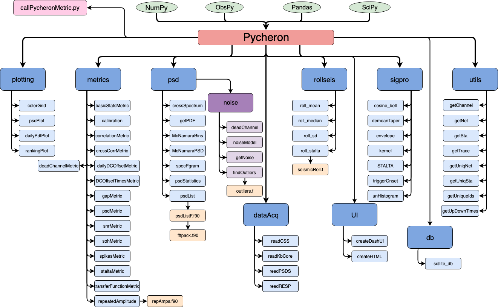

.. pycheron documentation master file, created by
   sphinx-quickstart on Mon Sep 30 15:09:26 2019.
   You can adapt this file completely to your liking, but it should at least
   contain the root `toctree` directive.

Welcome to Pycheron's documentation
====================================
.. toctree::
   :maxdepth: 2

Python library for seismic data quality control based on IRIS Mustang, IRISSeismic, and seismicRoll.

Indices and tables
------------------

* :ref:`genindex`
* :ref:`modindex`
* :ref:`search`
